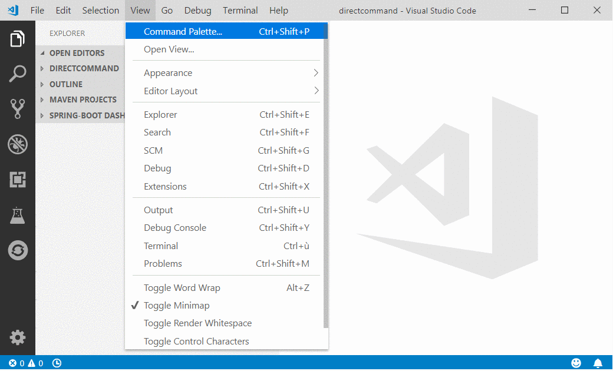
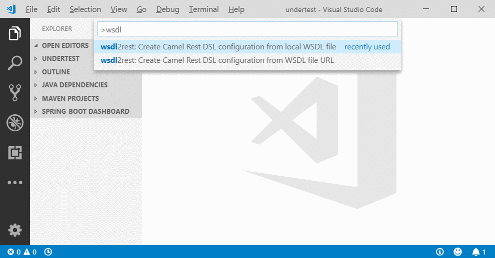

# VS Code Camel Extension Pack

This extension pack installs the following Visual Studio Code extensions that are useful to Apache Camel and Red Hat Fuse developers:

* [Project initializer by Red Hat](https://marketplace.visualstudio.com/items?itemName=redhat.project-initializer). It allows to create Apache Camel or Red Hat Fuse projects by selecting a mission.

* [Language Support for Apache Camel](https://marketplace.visualstudio.com/items?itemName=camel-tooling.vscode-apache-camel). It provides help for textual edition of Camel files (Completion, Validation, Navigation) For instance, see completion with Camel XML dsl:

* [Java Extension Pack](https://marketplace.visualstudio.com/items?itemName=vscjava.vscode-java-pack)? It provides a large set of tooling for Java applications.
* [SpringBoot extension pack](https://marketplace.visualstudio.com/items?itemName=Pivotal.vscode-boot-dev-pack) It provides a large set of tooling for SpringBoot applications.
* [OpenShift Connector](https://marketplace.visualstudio.com/items?itemName=redhat.vscode-openshift-connector)
* [WSDL to Camel Rest DSL](https://marketplace.visualstudio.com/items?itemName=camel-tooling.vscode-wsdl2rest) It allows to kickstart a project from a wsdl.

